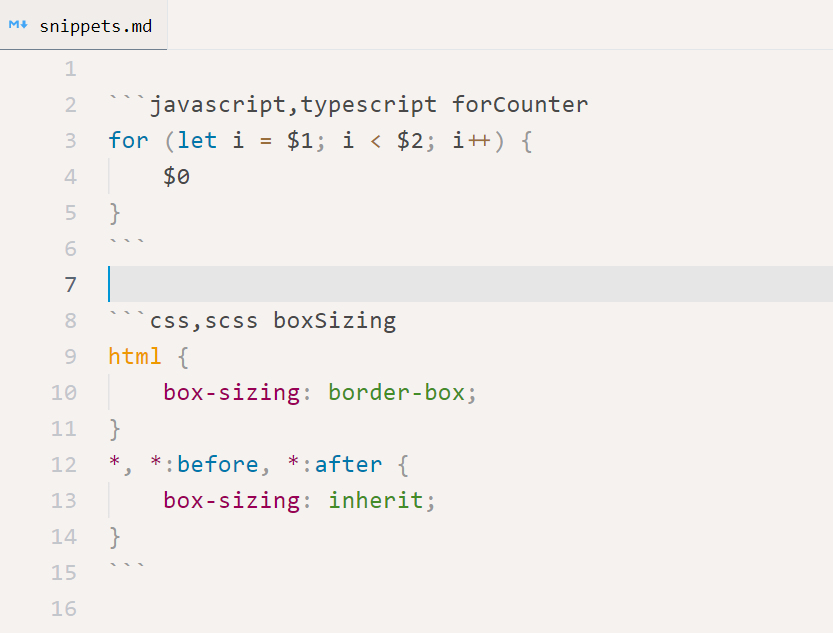

[](https://marketplace.visualstudio.com/items?itemName=usernamehw.snippets-in-markdown)
[](https://marketplace.visualstudio.com/items?itemName=usernamehw.snippets-in-markdown)
[](https://marketplace.visualstudio.com/items?itemName=usernamehw.snippets-in-markdown)

Use markdown file and Fenced Code Blocks to store all snippets. Example:

````
```javascript,typescript prefix1,prefix2 name description
console.log($0);
```
````



Use spaces for indentation in the `snippets.md` file (not tabs).

Snippet parts can be omitted by using underscore sign `_`.

There is autocomplete for variables such as `TM_SELECTED_TEXT`, but it doesn't auto show inside the code block (need to trigger suggest `editor.action.triggerSuggest` <kbd>Ctrl</kbd>+<kbd>Space</kbd>).


<!-- COMMANDS_START -->
## Commands (1)

|Command|Description|
|-|-|
|snippetsInMarkdown.openSnippetsFile|Snippets In Markdown: Open Global Snippets File|
<!-- COMMANDS_END -->

<!-- COLORS_START -->
## Colors (1)

Can be specified in `settings.json` (**`workbench.colorCustomizations`** section)

|Color|Dark|Light|HC|Description|
|-|-|-|-|-|
|snippetsInMarkdown.snippetVariableForeground|`#00bd94`|`#00bd94`|`#00bd94`|Variable highlights in `snippets.md` file, such as `$TM_SELECTED_TEXT`.|
<!-- COLORS_END -->